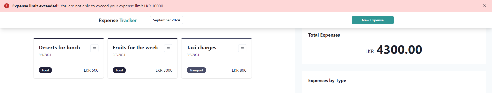

# Expense Tracker Application

###### **Current version: v1.0.0**

Expense Tracker is publicly available here: https://expense-tracker-by-bumuthu.vercel.app

## Overview
This project facilitates your expenses management. In this project, the following tech stack is used.

- Lerna: `8.1.6`
- NPM: `10.8.2`
- Node: `20.10.0`
- Express: `4.17.21`
- React: `18`
- Next: `14.2.7`

## Installation
This project is a mono repo project based on `npm` and `lerna` mono repo management tool. With that, you can get started easily by running the following commands from the root directory of the repo. This will build artifacts of each packages including `common` package which is required for other two packages. 

        npm install
        npm run build

## Usage
Then you can run the application by running the following command. This will run both UI and backend on `3000` and `3050` ports respectively.

        npm run start

Then, it will automatically open up the UI on `http:localhost:3000` in your browser. Here we go!

Enjoy managing your expenses list now! 

## Changelog

### [1.0.0] - 2024-09-01
#### Added
- Initial release of the project.
- Basic functionality implemented.

## Version History

| Version | Release Date | Notes                        |
|---------|--------------|------------------------------|
| 1.0.0   | 2024-09-01   | Initial release              |
